# 서울대 로컬 에이전트

**매일 오가던 학교 시스템과 작업 도구를 하나로. 배울 것을 찾는 데 쓰던 30분을 0분으로 줄이고, 녹음과 민감한 문서 작업은 내 Mac에서 끝내는 학생용 AI 작업실입니다.**

eTL·메일·메시지·캘린더·학교 공지를 읽어 오늘 할 일로 정리하고, 수업 녹음을 받아쓰고, 문서를 읽고 고치고 제출할 형식으로 만듭니다. 기본값은 로컬 처리이며, 작은 Mac에서 브리핑용 외부 API를 선택할 때는 무엇이 전송되는지 먼저 보여 줍니다.

이 저장소는 공모전 제출용으로 분리한 **학생용 배포판**입니다. 아래 설치·기능 안내는 이 저장소의
코드와 릴리스를 기준으로 합니다. [개인용 전체 앱](https://github.com/sesepark/seoul-local-agent)에는
SO-ARM101 원격 조작·시연 데이터 수집·DGX Spark 학습 큐·정책 실행 등 로봇 및 학습 서버 화면이
추가로 들어 있습니다. 전체 앱의 새 기능이 이 배포판에도 자동으로 포함되는 것은 아닙니다.

| 전 | 후 | 검증 가능한 현재 상태 |
|---|---|---|
| 매일 5곳 이상을 직접 확인 | 찾아다니는 시간 **30분 이상 → 0분** | **15개 화면 · 379개 자동 테스트** |
| 녹음·문서마다 다른 앱과 웹 서비스 | 확인 → 녹음·전사 → 문서 제출을 한 앱에서 | 설치 가능한 dmg와 전체 소스 공개 |
| 성적표·서류를 낯선 웹사이트에 업로드 | 파일 작업은 같은 Mac에서 완료 | 기본 로컬 AI · 선택형 API · Keychain |

## 한눈에 보는 두 가지 흐름

### 1. 배울 것을 찾는 시간 없애기

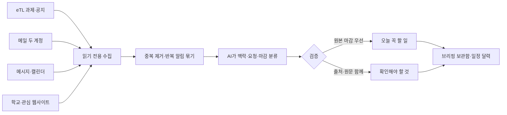

AI가 공부를 대신하지 않습니다. 밤사이 배울 것과 제출할 것을 찾아 정리해 두고, 사람은 아침에 화면 하나에서 확인하고 실제 공부로 바로 시작합니다.

### 2. 학생의 하루를 한 작업 공간으로 잇기

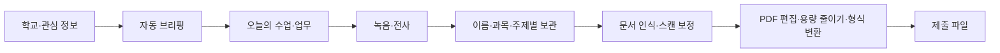

기능을 많이 모은 것이 목적이 아닙니다. 확인하던 자리, 기록하던 자리, 제출물을 만들던 자리가 계속 바뀌어 흐름이 끊기던 문제를 하나의 앱 안에서 이어 놓았습니다.

<table>
<tr>
<td width="50%">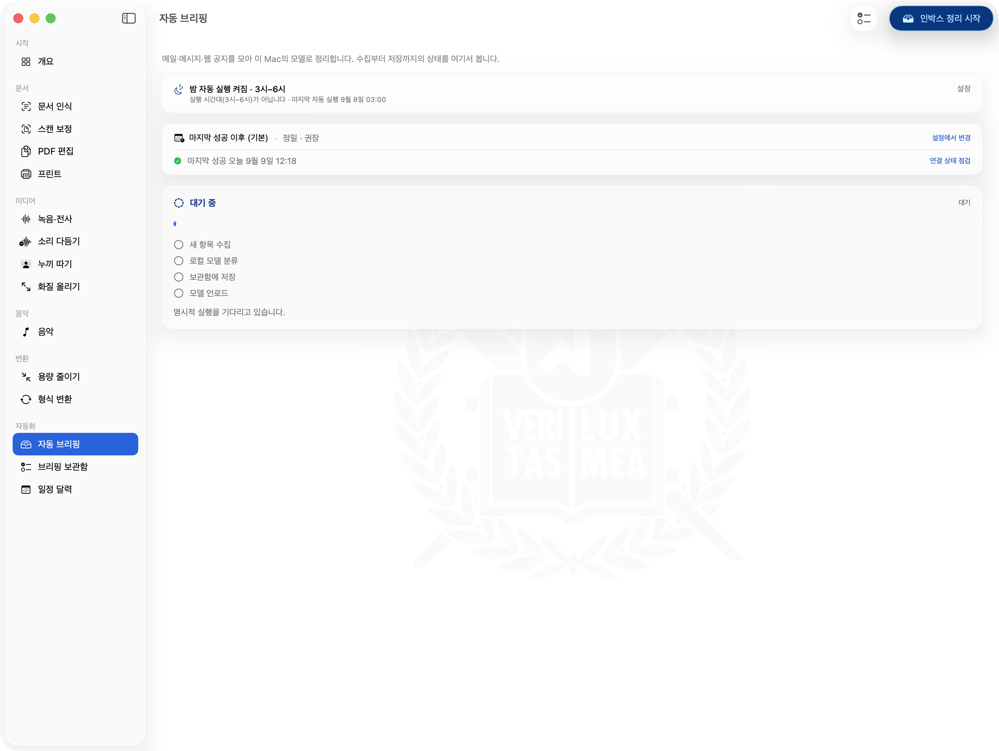</td>
<td width="50%">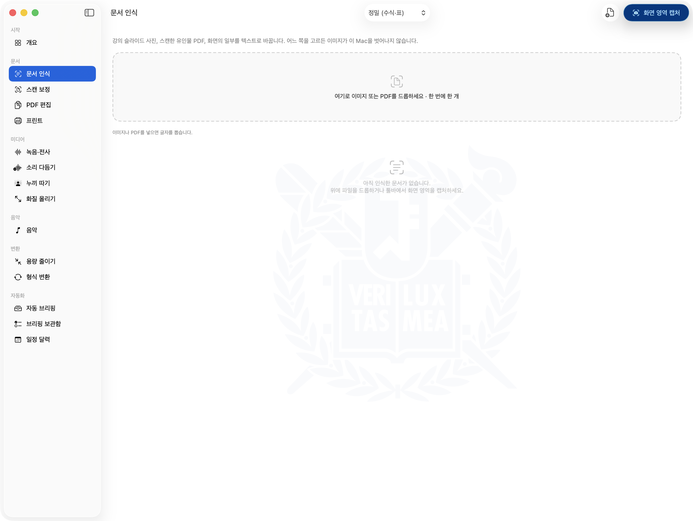</td>
</tr>
<tr>
<td align="center"><sub><b>자동 브리핑</b> — 수집·분류·저장·언로드가 네 단계로 보이고, <b>켜지 않으면 스스로 시작하지 않습니다</b></sub></td>
<td align="center"><sub><b>문서 인식</b> — 강의 슬라이드 사진과 스캔 PDF를 글자로. 이미지가 이 Mac을 벗어나지 않습니다</sub></td>
</tr>
<tr>
<td width="50%">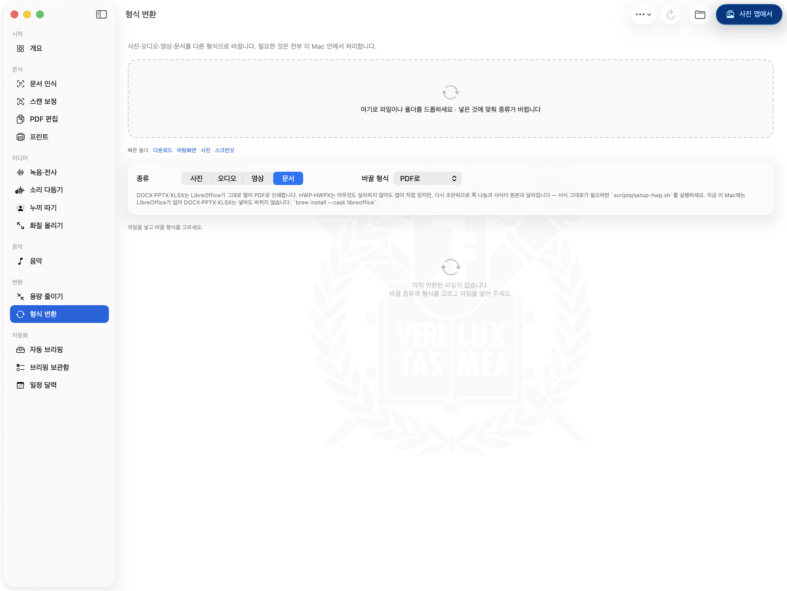</td>
<td width="50%">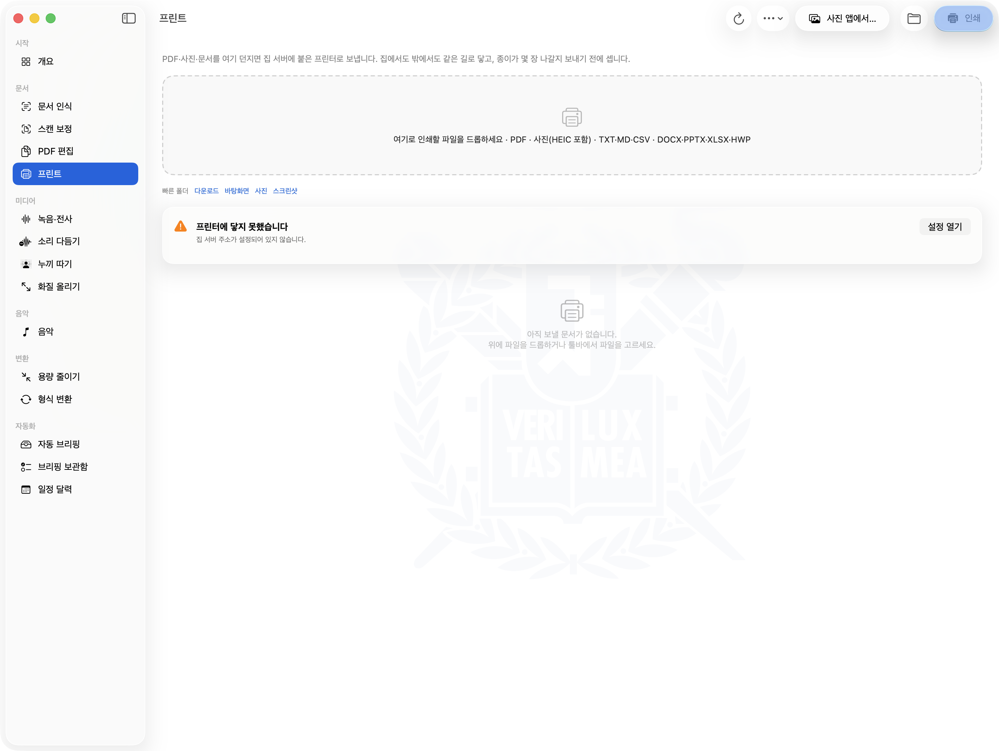</td>
</tr>
<tr>
<td align="center"><sub><b>형식 변환</b> — 사진·오디오·영상·문서를 다른 형식으로. 한글 문서(HWP·HWPX)도 읽습니다</sub></td>
<td align="center"><sub><b>프린트</b> — 설정하지 않으면 이렇게 아무것도 하지 않습니다. 나머지 기능에는 영향이 없습니다</sub></td>
</tr>
</table>

<p align="center">
  <b><a href="https://sesepark.github.io/snu-local-agent/">▶︎ 59초 데모 영상 보기</a></b> &nbsp;·&nbsp;
  <b><a href="https://github.com/sesepark/snu-local-agent/releases/latest">앱 내려받기 (dmg)</a></b>
</p>

**차례** — [두 가지 흐름](#한눈에-보는-두-가지-흐름) · [무엇을 할 수 있나](#무엇을-할-수-있나) · [설치](#설치) · [설정](#설정--무엇을-어디에-어떻게) · [화면별 안내](#화면별-안내) · [작동 원리](#작동-원리) · [어떻게 만들어졌나](#어떻게-만들어졌나)

---

## 무엇을 할 수 있나

| 화면 | 하는 일 |
|---|---|
| **개요** | 지금 무엇이 준비되어 있는지, 무엇이 빠졌는지, 어떻게 채우는지를 한 화면에서 |
| **문서 인식** | 강의 슬라이드 사진, 스캔한 유인물 PDF, 화면의 일부를 텍스트로. `빠름`은 macOS Vision, `정밀`은 수식을 LaTeX로·표를 표로 살린 Markdown |
| **스캔 보정** | 비스듬히 찍은 유인물을 반듯하게 펴고 그늘을 지워 스캔한 것처럼. 여러 장을 한 PDF로 |
| **PDF 편집** | 합치기·나누기·쪽 정리·암호 걸고 풀기·서명 이미지와 워터마크 |
| **프린트** | 집에 둔 서버에 붙은 프린터로. 미리보기가 실제로 나갈 파일 그대로이고, 종이가 몇 장 나갈지 먼저 셉니다 |
| **녹음·전사** | 앱에서 바로 녹음하거나 파일을 드롭해 한국어 전사와 타임스탬프. 누가 말했는지도 가릅니다 |
| **전역 받아쓰기** | 어느 앱에서든 단축키로 녹음 → 기기 내 변환 → 커서 자리에 삽입 |
| **소리 다듬기** | 강의 녹음에서 에어컨 소리와 웅성거림을 걷어내고 음량을 고르게 |
| **누끼 따기** | 사진을 드롭하면 배경을 지운 투명 PNG |
| **화질 올리기** | 뒷자리에서 찍은 슬라이드, 저해상도 스캔을 크고 또렷하게 |
| **음악** | YouTube에서 곡을 찾아 플레이리스트를 만들되, 소리는 광고가 없는 곳에서만 냅니다 |
| **용량 줄이기 · 형식 변환** | 사진·PDF·영상·오디오·문서. 한글 문서(HWP·HWPX)도 읽습니다 |
| **자동 브리핑 · 보관함 · 일정 달력** | 메일·메시지·캘린더·학교 공지·eTL을 읽기 전용으로 모아 `오늘 꼭 할 일` / `확인해야 할 것` / `기타`로 정리하고, 날짜별로 앱 안에 쌓습니다 |

세 가지만 먼저 알아 두면 됩니다.

- **아무것도 설정하지 않아도 절반은 됩니다.** 문서 인식(`빠름`)·스캔 보정·PDF 편집·용량 줄이기·형식 변환은 준비물이 없습니다.
- **준비하지 않은 소스는 조용히 빠질 뿐 다른 것을 막지 않습니다.** Gmail을 안 넣으면 Gmail만 0건이 되고 브리핑은 나머지로 그대로 돕니다.
- **눌러야 돕니다.** 배경에서 도는 폴링이 없고, 밤에 스스로 한 번 도는 것도 설정에서 켤 때만입니다.

## 작동 원리

### 자동 브리핑: 추측할 것과 이미 아는 것을 나눈다

| 단계 | 하는 일 | 틀리지 않기 위한 장치 |
|---|---|---|
| 수집 | Gmail·Slack·메시지·캘린더·eTL·공개 게시판을 병렬로 읽음 | 원본은 바꾸지 않는 읽기 전용 |
| 정제 | 사용자 규칙 적용, 중복 제거, 반복 알림 묶기 | 무시·항상 중요 규칙은 AI보다 우선 |
| 분류 | 맥락·요청·마감·중요도를 구조화된 결과로 생성 | JSON 구조 검사, 소스별 실패 격리 |
| 검증 | 분류 결과를 읽기 좋은 문장으로 정리 | eTL이 준 정확한 마감은 AI 추측을 덮어씀 |
| 보관 | 오늘 할 일·확인할 것·기타로 저장 | 전체 원문 대신 제한된 발췌, 파일 권한 0600 |
| 학습 | 사용자가 반복해서 옮긴 분류를 다음 실행에 반영 | 한 번의 실수는 규칙으로 굳히지 않음 |

같은 날 다시 실행해도 이미 분석한 항목을 전부 모델에 보내지 않습니다. 새롭거나 내용이 바뀐 것만 분석하고, 끝내지 않은 일은 마감과 사용자의 완료 표시를 확인한 뒤 다음 날로 이어집니다.

### 개인정보 경계

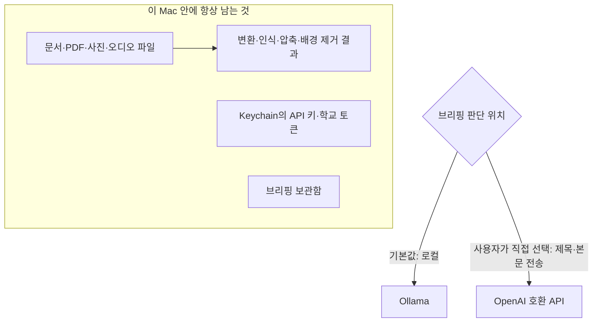

| 선택 | 밖으로 나가는 것 | 밖으로 나가지 않는 것 |
|---|---|---|
| 로컬 Ollama | 없음 | 메일·공지·메시지 본문, 모든 파일 |
| 외부 API | 브리핑 분류·전사 정리에 필요한 텍스트 | 문서·PDF·사진·오디오 파일 자체 |

API 키와 eTL·Slack 토큰은 macOS Keychain에만 둡니다. 저장소와 일반 설정 파일에는 기록하지 않습니다.

---

## 설치

### 필요한 것

- **Apple Silicon 맥** (M1 이상). Intel 맥과 윈도우는 지원하지 않습니다.
- **macOS 26** 이상.
- **[Ollama](https://ollama.com)** — 브리핑 분류와 요약이 쓰는 로컬 모델을 돌립니다. 메모리가 작은 맥이라면 [API로 연결](#메모리가-작은-맥이라면--api로-연결)해 건너뛸 수 있습니다.
- **[uv](https://docs.astral.sh/uv/)** — 파이썬 도구들의 환경을 만듭니다. `brew install uv`
- **Xcode 명령줄 도구** — `xcode-select --install`

### 1. 받기 — 둘 중 하나

**그냥 쓰려면** — [최신 릴리스](https://github.com/sesepark/snu-local-agent/releases/latest)에서 `SeoulLocalAgent.dmg`를 받아 앱을 `Applications`로 끌어다 놓으세요. 빌드도 `git`도 필요 없습니다.

**고쳐 쓰려면**

```sh
git clone https://github.com/sesepark/snu-local-agent.git
cd snu-local-agent
./scripts/build-app-bundle.sh      # dist/SeoulLocalAgent.app
./scripts/make-dmg.sh              # dist/SeoulLocalAgent.dmg
```

### 2. 처음 열 때 (Gatekeeper)

이 앱은 Apple에 공증(notarization)을 받지 않았습니다. 유료 개발자 등록이 필요한 절차이고, 학생이 학생에게 나눠 주는 도구에 그것까지 두지는 않았습니다. 그래서 처음 열 때는 두 번 누르지 말고 **우클릭 → 열기**를 쓰세요. 한 번만 하면 그다음부터는 평소처럼 열립니다.

> 그래도 열리지 않으면: `xattr -dr com.apple.quarantine /Applications/SeoulLocalAgent.app`

### 3. 쓰고 싶은 도구만 골라 준비하기

각각 독립이라 **필요한 것만** 돌리면 됩니다.

```sh
brew install uv

./scripts/setup-transcription-env.sh   # 녹음·전사, 전역 받아쓰기
./scripts/setup-matting-env.sh         # 누끼 따기
./scripts/setup-media-env.sh           # 소리 다듬기, 화질 올리기
./scripts/setup-docparse-env.sh        # 문서 인식 `정밀`
./scripts/setup-hwp.sh                 # 한글 문서를 서식째 변환
```

`.dmg`로 받았다면 저장소가 없으므로 앱 안의 같은 스크립트를 부르면 됩니다.

```sh
/Applications/SeoulLocalAgent.app/Contents/Resources/scripts/setup-transcription-env.sh
```

가상환경은 앱 번들이 아니라 `~/Library/Application Support/SeoulLocalAgent/venvs/`에 만들어집니다. 서명된 번들 안에는 쓸 수 없기 때문입니다.

---

## 설정 — 무엇을, 어디에, 어떻게

> **지금 무엇이 켜져 있는지 보는 법**
> 앱을 열고 **설정(⌘,) › 연결 상태**. 항목마다 되는지 안 되는지와, 안 되면 눌러서 복사할 명령이 함께 나옵니다. 창 없이 보려면:
> ```sh
> dist/SeoulLocalAgent.app/Contents/MacOS/SeoulLocalAgent --connection-check
> ```

### 로컬 모델 (브리핑 분류·요약)

```sh
brew install ollama      # 없다면
ollama serve             # 켜 둡니다
```

**자기 맥에 해당하는 줄 하나만** 받으세요. 어느 것을 받아야 하는지는 **설정 › 연결 상태**에 그대로 적혀 있습니다.

| 메모리 | 받을 모델 | 가중치 |
|---|---|---|
| 48 GB 이상 | `ollama pull qwen3.6:35b-a3b-nvfp4` | 22.0 GB |
| 36 GB 이상 | `ollama pull qwen3:30b-a3b-q4_K_M` | 17.3 GB |
| 32 GB 이상 | `ollama pull gpt-oss:20b` | 12.8 GB |
| 32 GB 미만 | 로컬 모델 대신 [API로 연결](#메모리가-작은-맥이라면--api로-연결) | — |

메모리의 절반을 넘는 모델은 실패하지 않고 **조용히 느려지기만** 합니다. 그래서 32GB 미만인 맥에서는 앱이 Ollama에 묻기도 전에 "이 맥에서는 로컬 모델이 버겁습니다"라고 먼저 말합니다. 그래도 시도하려면 **설정 › 브리핑 › 판단 위치**의 `직접 지정` 칸에 Ollama 태그를 적으면 그 선택이 이깁니다.

**국산 모델을 쓰고 싶다면** — 입력의 대부분이 한국어 공지와 메일이므로, 한국어로 학습된 모델을 쓰는 선택에는 근거가 있습니다. **설정 › 브리핑 › 판단 위치**의 `국산 모델로 바꾸기`에서 한 번 누르면 됩니다.

| 메모리 | 국산 모델 | 가중치 |
|---|---|---|
| 48 GB 이상 | `ollama pull exaone3.5:32b` | 19.0 GB |
| 16 GB 이상 | `ollama pull exaone3.5:7.8b` | 4.8 GB |
| 8 GB 이상 | `ollama pull exaone3.5:2.4b` | 1.6 GB |

EXAONE 3.5는 LG AI Research의 한국어·영어 모델입니다. 자동 선택 목록에는 넣지 않았습니다 — 위의 셋은 전부 MoE라 같은 메모리에서 몇 배 빠르고, EXAONE은 밀집 모델이라 자동으로 골라 주면 느려진 이유를 알 수 없기 때문입니다. 골라야 켜집니다.

### 메모리가 작은 맥이라면 — API로 연결

로컬 모델이 이 앱의 기본값이자 존재 이유입니다. 성적표와 장학금 서류를 낯선 서비스에 올리지 않으려고 만든 앱이니까요. 다만 그 전제는 만든 사람의 맥(64GB)에서만 성립했고, **16GB 맥에서는 앱을 켤 수조차 없다**는 뜻이기도 했습니다.

그래서 판단의 자리를 하나 더 열어 두었습니다. **설정 › 브리핑 › 판단 위치**에서 `API로 연결`을 고르면, OpenAI 호환 `/chat/completions`를 내는 곳이면 어디든 붙습니다.

| 제공처 | 주소 | 모델 예 |
|---|---|---|
| 업스테이지 Solar (국산) | `https://api.upstage.ai/v1` | `solar-pro2` |
| OpenAI | `https://api.openai.com/v1` | `gpt-4o-mini` |
| 직접 입력 | 사내 게이트웨이, 다른 기기의 Ollama 등 | — |

키는 **macOS Keychain에만** 저장됩니다. 저장소에도, 설정 파일에도 남지 않습니다.

무엇이 나가는지는 켜기 전에 같은 화면이 말합니다. **브리핑 분류와 전사 정리만** 이 설정을 따릅니다 — 파일 변환, 문서 인식, 배경 제거, 화질 개선은 모델을 쓰지 않거나 이 Mac 안의 것만 쓰므로, 어떤 설정에서도 **파일 자체는 이 맥을 떠나지 않습니다.**

### macOS 권한

메시지·캘린더·미리 알림은 macOS가 처음 쓸 때 물어봅니다. **거부해도 됩니다** — 그 소스만 빠집니다. 전역 받아쓰기를 쓰려면 **손쉬운 사용**(키 입력 삽입)과 **입력 모니터링**(단축키 감지)이 필요하고, 앱이 처음 시도할 때 안내합니다.

### Gmail — 읽기 전용

`gog`가 Google 계정에 붙고, 앱은 그것을 **읽기 전용으로만** 부릅니다. 메일을 보내거나 읽음으로 바꾸거나 지우는 경로는 앱에 없습니다.

```sh
brew install steipete/tap/gog     # https://github.com/steipete/gog
gog auth login                    # 브라우저에서 계정 승인
```

볼 주소를 이 파일에 적습니다. **없으면 직접 만드세요.**

```
~/Library/Application Support/SeoulLocalAgent/gmail-accounts.json
```
```json
[
  { "address": "you@snu.ac.kr", "mailboxIndex": 0 },
  { "address": "you@gmail.com", "mailboxIndex": 1 }
]
```

`mailboxIndex`는 계정을 여럿 쓸 때 `gog`가 매기는 순번이고, 하나만 쓰면 `0`입니다. 주소를 소스가 아니라 이 파일에 두는 이유는 그것이 개인 정보이기 때문입니다.

### eTL — 과목 공지와 과제 마감

수업이 실제로 도는 `myetl.snu.ac.kr`은 **Canvas LMS**입니다. 문서화된 REST API가 열려 있어서 앱은 화면을 긁지 않고 그 API만 읽습니다. 과제 마감이 문장이 아니라 `due_at` 필드로 오기 때문에 날짜를 추측할 필요가 없습니다.

**토큰 발급**

1. <https://myetl.snu.ac.kr> 로그인
2. 왼쪽 맨 아래 **계정(Account)** → **설정(Settings)**
3. 아래로 내려 **승인된 통합(Approved Integrations)** → **+ 새 액세스 토큰**
4. 용도에 아무 이름(예: `로컬 에이전트`)을 적고 생성
5. **토큰은 이때 한 번만 보입니다.** 복사해 두세요.

**토큰 넣기** — 아래를 실행하고, 커서가 멈추면 토큰을 붙여 넣고 Enter. **입력한 값은 화면에 보이지 않습니다.**

```sh
security add-generic-password -U -s com.seoullocalagent.etl.token -a myetl -w
```

토큰은 계정 전체 권한을 가진 자격증명이라 저장소에도, 설정 파일에도 두지 않고 **Keychain에만** 들어갑니다. 명령에 값을 인자로 붙이지 않는 이유는 셸 기록에 남지 않게 하려는 것입니다.

**확인** — **설정 › 연결 상태**의 eTL 줄이 `2026-2학기 · 6과목 · 읽기 전용으로 응답합니다`처럼 학기와 과목 수를 말하면 된 것입니다. 학기 중인데 0과목이면 다른 계정의 토큰입니다.

> 온라인 강의 진도와 출석은 일부러 다루지 않습니다. 그쪽만 Canvas가 아니라 학교가 얹은 별도 레이어에 있어 문서가 없고, 학교가 갱신하면 조용히 깨집니다.

### Slack — 읽기 전용 (선택)

```sh
security add-generic-password -U -s kr.ac.snu.local-agent.slack -a read-token -w
```

같은 방식으로 커서가 멈추면 붙여 넣습니다. 사용자 토큰(`xoxp-`)이면 자기 DM과 들어가 있는 채널을 읽습니다.

### 학교 공지 게시판

단과대·본부 게시판 20여 곳이 이미 등록되어 있고 대부분 켜져 있습니다. 자기 학과만 남기려면 목록 파일에서 `enabled`를 `false`로 바꾸세요. 공개 페이지만 읽으므로 로그인 정보는 필요 없습니다.

```
~/Library/Application Support/SeoulLocalAgent/web-notices.json
```

### 녹음 화자 구분 (선택)

전사 자체는 준비물이 없지만, **누가 말했는지 가르려면** Hugging Face 토큰이 하나 필요합니다.

1. <https://huggingface.co/pyannote/speaker-diarization-community-1> 에서 약관 동의
2. <https://huggingface.co/settings/tokens> 에서 **읽기** 토큰 생성
3. 앱의 **설정 › 전사**에 붙여 넣기 (이 Mac의 Keychain에만 저장됩니다)

토큰이 없어도 전사는 됩니다. 화자 이름만 붙지 않습니다.

### 음악 — YouTube 검색 (선택)

곡을 **찾는** 데만 YouTube를 씁니다. 소리는 광고가 없는 곳에서 먼저 찾습니다.

1. <https://console.cloud.google.com> 에서 프로젝트 생성
2. **YouTube Data API v3** 사용 설정
3. 사용자 인증 정보 → **API 키** 만들기
4. 앱의 **설정 › 음악**에 붙여 넣기 (`youtube-config.json`에 저장됩니다)

키가 없어도 **무료 음원 검색**(Audius·Internet Archive)과 **내 음악**은 그대로 됩니다.

### 프린터 (선택)

집에 서버를 두고 프린터를 USB로 붙여 둔 경우에만 쓰는 기능입니다. 라즈베리파이면 충분합니다.

1. **설정 › 프린터 › 서버**에 `집에서 쓸 주소`(LAN)와 `집 밖에서 쓸 주소`(사설망, 비워도 됨), 계정을 넣습니다. 두 칸을 다 채우면 어디에 있든 먼저 열리는 쪽으로 붙습니다.
2. **이 앱의 열쇠** 항목의 `등록 명령 복사`를 눌러 그 명령을 터미널에서 한 번 실행합니다. 앱은 `~/.ssh`를 읽지 않아서, 터미널에서 되는 접속이 앱에서는 되지 않습니다. 이 열쇠는 서버의 `authorized_keys`에서 언제든 지울 수 있습니다.
3. 프린트 화면에서 `새로고침`을 누르면 프린터 목록을 읽어 옵니다.

### 파일은 어디에 있나

전부 이 Mac 안에만 있습니다.

| 무엇 | 어디 |
|---|---|
| 브리핑 결과 (최근 90일) | `~/Library/Application Support/SeoulLocalAgent/briefing-archive.json` (권한 `0600`) |
| Gmail 계정 목록 · 공지 게시판 · YouTube 키 · 프린터 설정 | 같은 폴더의 `gmail-accounts.json` · `web-notices.json` · `youtube-config.json` · `home-server.json` |
| eTL · Slack · Hugging Face 토큰 | **Keychain** (파일이 아닙니다) |

```sh
open ~/Library/Application\ Support/SeoulLocalAgent    # 폴더 열기
```

전부 지우려면:

```sh
rm -rf ~/Library/Application\ Support/SeoulLocalAgent
security delete-generic-password -s com.seoullocalagent.etl.token
security delete-generic-password -s kr.ac.snu.local-agent.slack
security delete-generic-password -s kr.ac.snu.local-agent.pyannote
defaults delete kr.ac.snu.local-agent
```

---

## 화면별 안내

준비물이 있는 화면은 **⚙︎** 로 표시했습니다. 표시가 없으면 빌드하면 바로 됩니다.

### 개요 `⌘1`

지금 이 Mac에서 무엇이 도는지, 무엇이 준비되어 있고 무엇이 빠졌는지를 한 화면에 모읍니다. 위쪽 카드 다섯 개가 브리핑 상태·녹음 개수·받아쓰기 단축키·음악·프린터를 요약하고, 그 아래에 **오늘 마감**과 **밀린 것**이 옵니다. 마지막 정리에서 실패한 소스가 있으면 그 사유가 첫 화면에 그대로 뜹니다 — 조용히 빠진 소스를 모른 채 지나가지 않게 하려는 것입니다.

> 사진 없음. 실제 메일 제목과 마감이 그대로 나오는 화면이라 공개 저장소에 올릴 것이 아닙니다.

### 문서 인식 `⌘2`


강의 슬라이드를 찍은 사진, 스캔한 유인물 PDF, 또는 화면의 일부를 글자로 바꿉니다.

- **빠름** — macOS Vision. 준비물이 없고 즉시 끝납니다.
- **정밀 (수식·표)** ⚙︎ — MinerU가 수식을 LaTeX로, 표를 표로 살린 Markdown을 만듭니다. `setup-docparse-env.sh`

툴바의 `화면 영역 캡처`를 누르면 화면에서 직접 영역을 골라 바로 인식합니다.

### 스캔 보정 `⌘3`

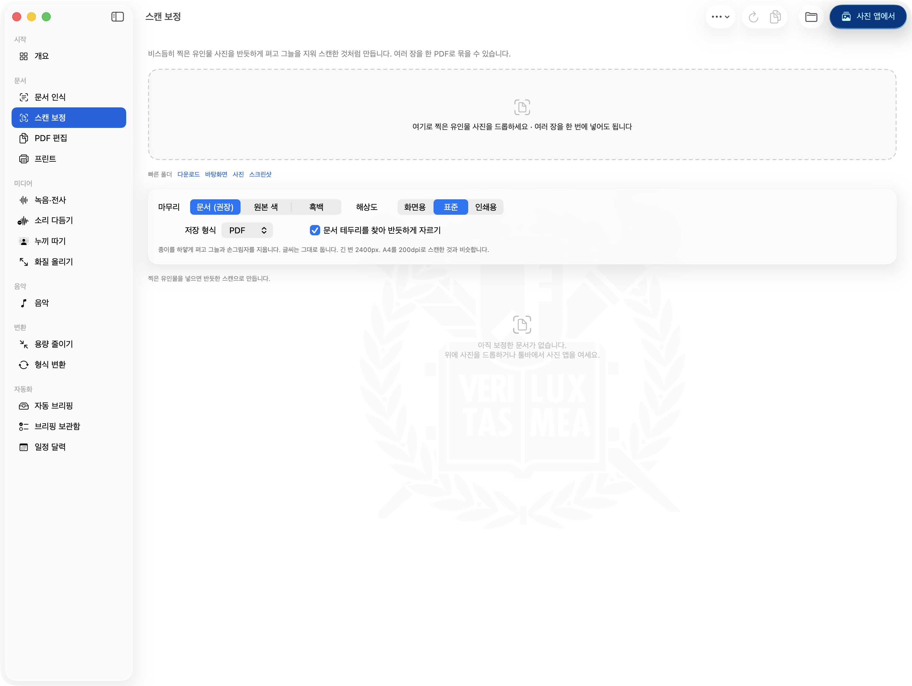

비스듬히 찍은 유인물 사진을 반듯하게 펴고, 그늘과 얼룩을 지워 스캔한 것처럼 만듭니다. 네 귀퉁이를 자동으로 찾고, 틀리면 직접 끌어 고칠 수 있습니다. 여러 장을 한 PDF로 묶어 냅니다.

### PDF 편집 `⌘4`

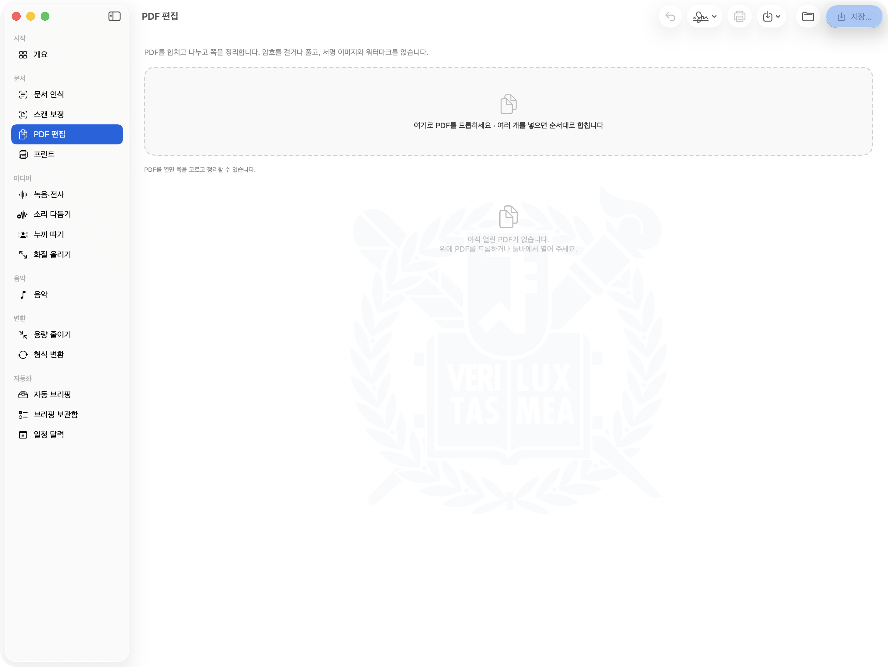

여러 PDF를 드롭하면 넣은 순서대로 합칩니다. 쪽을 지우고 돌리고 순서를 바꾸고, 범위를 잘라 새 파일로 냅니다. 암호를 걸거나 풀 수 있고, 서명 이미지와 워터마크를 얹을 수 있습니다.

### 프린트 `⌘P` ⚙︎


집에 둔 서버에 USB로 붙은 프린터로 보냅니다. **설정하지 않으면 사진처럼 아무것도 하지 않습니다.**

설정한 뒤에는 PDF·사진·문서(한글 포함)를 드롭하면 됩니다. 이 화면의 특징은 **미리보기가 실제로 나갈 파일 그대로**라는 것입니다 — 쪽 범위·모아찍기·회전을 프린터가 아니라 이 Mac에서 파일에 먼저 적용하고, 그 파일을 그려서 보여 줍니다. 종이가 몇 장 나갈지도 누르기 전에 셉니다.

### 녹음·전사 `⌘5` ⚙︎

앱에서 바로 녹음하거나, 오디오·영상 파일을 드롭하거나, 강의 영상 주소를 붙여넣으면 오디오만 내려받아 한국어 전사를 만듭니다. 타임스탬프가 붙고, 토큰을 넣어 두면 누가 말했는지도 가릅니다. 녹음마다 이름과 과목·주제 태그를 달아 나중에 묶어 볼 수 있습니다. `setup-transcription-env.sh`

> 사진 없음. 녹음 보관함에 실제 녹음 목록이 그대로 나옵니다.

### 소리 다듬기 `⌘6` ⚙︎

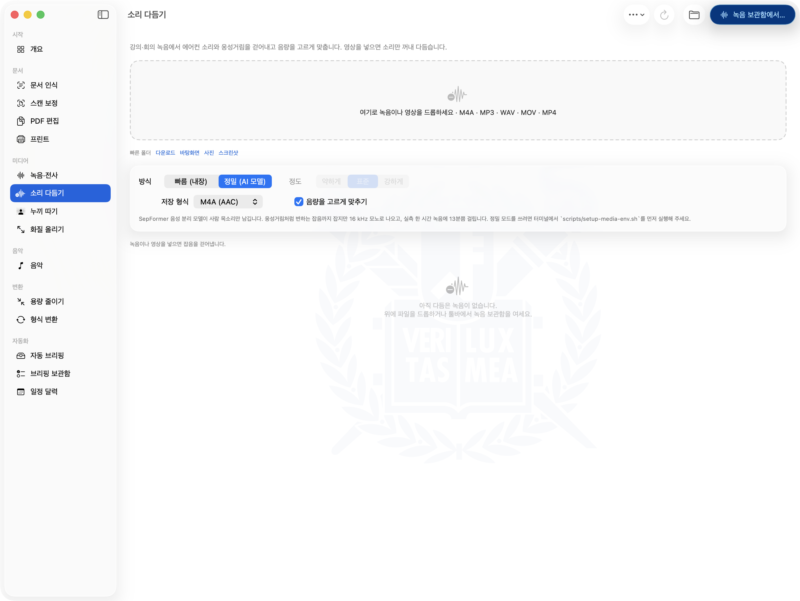

강의·회의 녹음에서 에어컨 소리와 웅성거림을 걷어내고 음량을 고르게 맞춥니다.

- **빠름 (내장)** — 스펙트럼 게이트. 준비물이 없습니다.
- **정밀 (AI 모델)** — SepFormer가 사람 목소리만 남깁니다. 변하는 잡음까지 잡지만 16 kHz 모노로 나옵니다. `setup-media-env.sh`

### 누끼 따기 `⌘7` ⚙︎

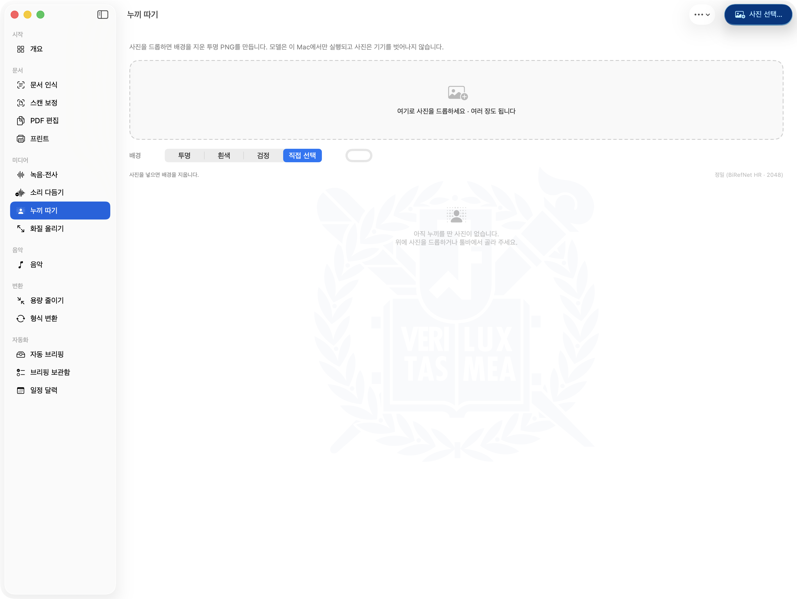

사진을 드롭하면 배경을 지운 투명 PNG를 만듭니다. 배경을 특정 색으로 채울 수도 있습니다. 모델은 이 Mac에서만 돌고 사진은 기기를 벗어나지 않습니다. `setup-matting-env.sh`

### 화질 올리기 `⌘8` ⚙︎

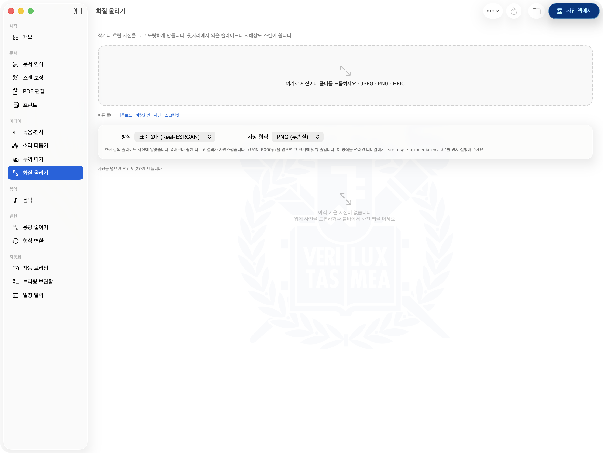

작거나 흐린 사진을 크고 또렷하게 만듭니다. 뒷자리에서 찍은 슬라이드나 저해상도 스캔에 씁니다. `setup-media-env.sh` (소리 다듬기와 같은 환경)

### 음악 `⇧⌘M` ⚙︎

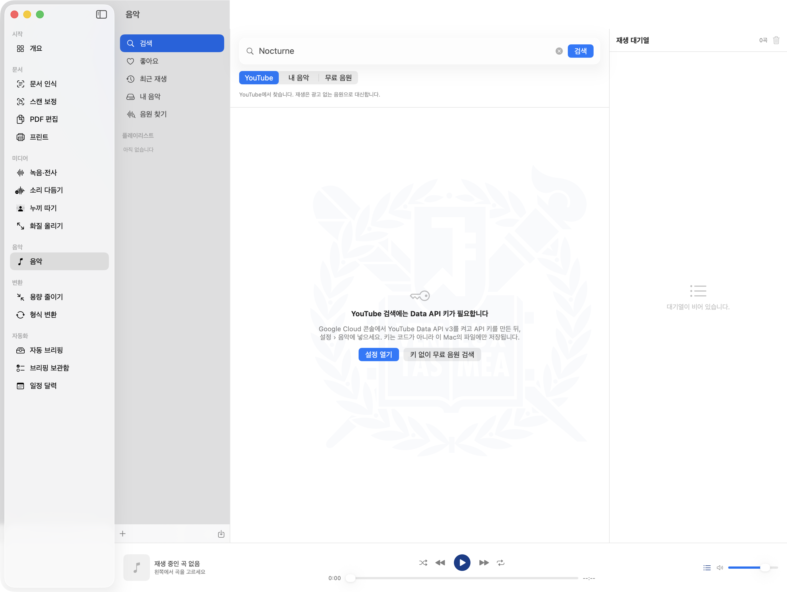

곡을 찾아 플레이리스트를 만들되, **소리는 광고가 없는 곳에서만** 냅니다.

- **찾기** — YouTube에서 검색합니다. Data API 키가 없으면 사진처럼 그렇게 말합니다.
- **재생** — 이 Mac의 음악 파일 → Audius → Internet Archive 순서로 같은 곡을 찾아 그것으로 냅니다. 셋 다 없으면 직접 고르거나 YouTube 폴백으로 재생하고, 어느 경로로 났는지 목록에 적힙니다.

계정은 없고 보관함은 이 Mac의 파일 하나입니다.

### 용량 줄이기 `⌘9`

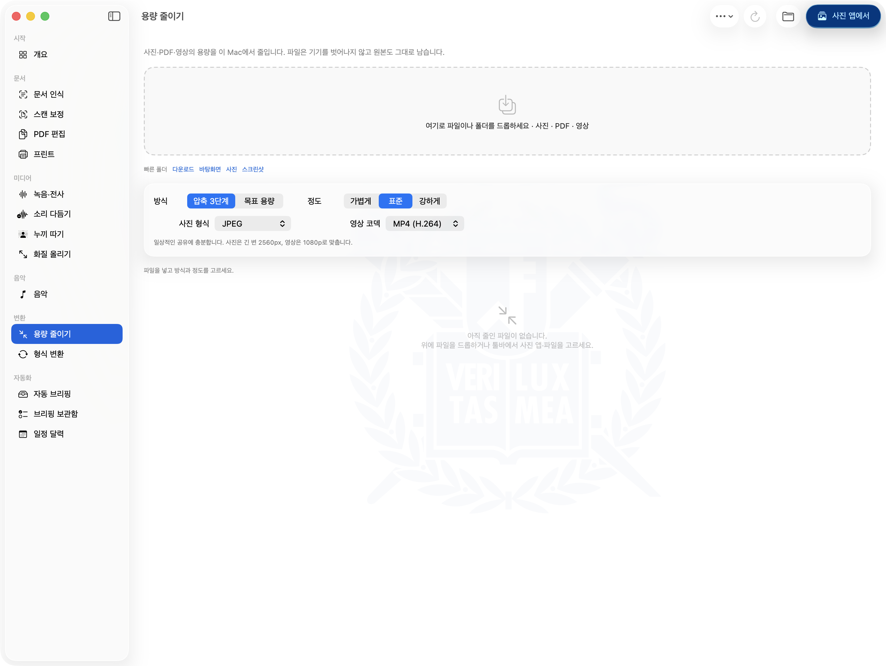

사진·PDF·영상의 용량을 줄입니다. 3단계로 고르거나, **목표 용량**을 적어 그 밑으로 맞출 수도 있습니다(제출 용량 제한이 있을 때 씁니다). 원본은 그대로 남습니다.

### 형식 변환 `⌘0`


사진·오디오·영상·문서를 다른 형식으로 바꿉니다. 넣은 파일에 맞춰 종류가 자동으로 바뀝니다.

**한글 문서(HWP 5.x·HWPX)를 아무것도 설치하지 않아도 앱이 직접 읽습니다.** 다만 다시 조판하므로 쪽 나눔과 서식이 원본과 달라집니다. 서식 그대로가 필요하면 `setup-hwp.sh`를 실행하세요. DOCX·PPTX·XLSX는 LibreOffice가 있어야 합니다.

### 자동 브리핑 `⌘B` ⚙︎


메일·메시지·캘린더·학교 공지·eTL을 읽기 전용으로 모아 이 Mac의 모델로 정리합니다. 이 화면은 결과가 아니라 **상태**를 보여 줍니다 — 새 항목 수집 → 로컬 모델 분류 → 보관함에 저장 → 모델 언로드의 네 단계가 어디까지 갔는지, 마지막 성공이 언제였는지.

사진 아래쪽의 `명시적 실행을 기다리고 있습니다`가 이 앱의 기본 상태입니다. **눌러야 돕니다.** 밤에 스스로 한 번 도는 것은 설정에서 켤 때만이고, 그때도 전원이 꽂혀 있고 노트북이 열려 있고 한동안 아무것도 누르지 않았을 때만 시작합니다.

### 브리핑 보관함 `⇧⌘B`

정리된 결과가 날짜별로 쌓입니다(최근 90일). 끝낸 일에 체크하고 메모를 달고, 잘못 분류된 항목은 **한 칸씩** 옮기고(두 칸을 건너뛰지 않습니다), 그 항목만 다시 분석시키고, Mac 캘린더나 미리 알림으로 넘기고, 보관된 모든 날에서 검색합니다.

> 사진 없음 — 실제 메일 제목이 그대로 나오는 화면입니다.

### 일정 달력 `⌥⌘B`

브리핑에서 나온 마감과, 캘린더·미리 알림으로 넘긴 일정을 한 달치 달력에 모읍니다. 날짜를 읽지 못한 항목은 아래에 따로 셉니다 — 달력에 없다고 해서 마감이 없는 것은 아니기 때문입니다.

> 사진 없음 — 같은 이유입니다.

### 설정 `⌘,`

**브리핑**(로컬 모델·수집 범위·분석 품질·밤 자동 실행) · **연결 상태** · **분류 기준** · **전사** · **받아쓰기** · **도구** · **음악** · **프린터** 여덟 탭입니다.

---

## 어떻게 만들어졌나

여기부터는 이 앱이 왜 이런 모양인지에 대한 것입니다. 쓰는 데는 필요하지 않습니다.

### 이 앱이 서 있는 자리

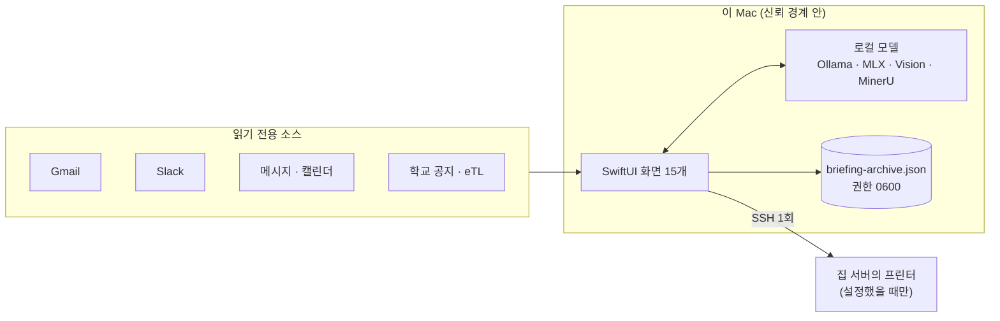

바깥으로 나가는 길은 둘뿐입니다. 읽기 전용으로 읽어 오는 길과, 설정했을 때만 열리는 프린터로 가는 SSH 한 번. 수집한 내용은 이 맥의 파일 하나에만 쌓입니다.

### 모델은 기계를 따라간다

브리핑 분류에 쓰는 모델 이름이 코드에 상수로 박혀 있었습니다. 만든 사람의 맥이 64GB였기 때문에 성립하던 값이고, 16GB인 맥에서 그 줄은 조용한 스왑을 뜻합니다.

그래서 등급을 임의로 나누는 대신 규칙 하나를 둡니다 — **가중치가 물리 메모리의 절반 안에 들어와야 한다.** 통합 메모리에서 절반을 넘기면 OS와 앱이 쓸 자리가 남지 않고, 그때 벌어지는 일은 실패가 아니라 **전부 조용히 느려지는 것**이라 알아채기 어렵습니다.

앱은 켜질 때 `hw.memsize`와 칩 이름을 읽고, 카탈로그에서 그 예산에 들어가는 가장 큰 모델을 고릅니다. 카탈로그의 셋은 전부 **4비트 MoE**입니다 — 같은 메모리에서 mixture-of-experts는 토큰마다 파라미터의 일부만 켜므로, 같은 발자국의 밀집 모델보다 몇 배 빠르게 답합니다. 어느 것도 들어가지 않는 맥이면 준비 상태 화면이 Ollama에 묻기 **전에** 그렇게 말합니다. 모델이 설치되어 있더라도 `준비됨`은 틀린 답이기 때문입니다.

### 왜 로컬인가

제출 용량에 맞춰 PDF를 줄이거나, 발표 자료에 쓸 사진의 배경을 지우거나, 한글 문서를 PDF로 바꾸는 일이 생길 때마다 웹에서 무료 서비스를 찾아 헤맸습니다. 그러다 보면 성적표와 장학금 서류와 아직 내지 않은 과제를 처음 보는 사이트에 올리게 되고, **그 파일들이 어디에 얼마나 남는지는 알 수 없습니다.** 올리지 않고 처리하려면 도구가 기기 안에 있어야 합니다.

그래서 기준은 둘입니다. **데이터가 이 맥을 벗어나지 않는다**, 그리고 **사용자가 켜지 않은 것은 스스로 시작하지 않는다.**

### 프로세스는 반드시 죽는다

파이썬 러너 몇 개는 파일 사이에 모델을 메모리에 물고 상주합니다. 그것이 남으면 사용자의 맥은 아무 이유 없이 몇 GB를 잃습니다. 그래서 한 겹에 기대지 않고 겹쳐 둡니다 — 명시적 종료, 프로세스 트리 정리, 그리고 다음 실행이 명령줄의 고정 표식으로 지난번의 유령을 찾아 죽이는 것.

### 확장 가능성 — 이 앱의 원래 모습

이 저장소는 개인용으로 만든 것에서 로봇 부분을 걷어낸 배포판입니다. 원래 앱에는 화면이 일곱 개 더 있습니다. 집 서버에 붙은 로봇 팔(SO-ARM101)을 SSH 터널 너머로 조작하고, 3D로 그린 팔을 끌면 진짜 팔이 따라오고, VLA 학습용 시연을 찍고, 그 데이터셋을 학습 서버로 보내 정책을 학습시키고, 학습된 정책을 팔에 태워 자리별 성공률을 재는 화면들입니다.

여기서 뺀 이유는 그것이 특정 하드웨어를 전제로 하기 때문입니다. 다만 얼개는 그대로 남아 있습니다 — **집에 둔 서버를 SSH 너머의 원격 제어면으로 삼고, 무거운 계산은 그쪽이 하고, 맥은 화면과 안전만 쥔다.** 그 구조가 프린트 화면에 살아 있고, 다른 장치를 같은 방식으로 붙이는 데 필요한 것은 서버 쪽 HTTP API 하나입니다.

받아 가는 사람이 자기 전공과 관심사에 맞게 저마다 다르게 넓혀 갈 수 있도록, 화면 하나를 더하는 데 고쳐야 할 곳이 적게 만들어 두었습니다. 사이드바에 화면을 등록하는 자리는 `Models.swift`의 `AppSection` 한 곳이고, 나머지는 그 열거형을 따라갑니다.

### 만든 방법

서울대가 구성원에게 제공하는 **ChatGPT Edu** 계정으로 로그인한 Codex를 설계 파트너로 삼아 시작했습니다. 코드를 받아 적는 것이 아니라, 무엇을 어떤 구조로 만들지를 묻고 답을 검증하는 방식이었습니다.

이 저장소에 남아 있는 결정 몇 가지가 그 대화에서 나왔습니다. 수집은 읽기 전용으로만 하고 판단은 이 기기의 모델이 한다는 것, 그리고 중요·무시 판단을 프롬프트 안의 상수로 두지 않는다는 것 — 규칙이 코드에 숨어 있으면 사용자는 "내가 의도한 적 없는데 왜 이게 빠졌지?"를 영영 알 수 없기 때문입니다. 그것이 지금의 `설정 › 분류 기준` 화면입니다.

지금 이 저장소는 Swift 3.4만 줄, 화면 15개, 테스트 369개입니다.

```sh
./scripts/run-tests.sh
```

## 라이선스

MIT. 마음대로 쓰고 고치고 나눠 주세요.
