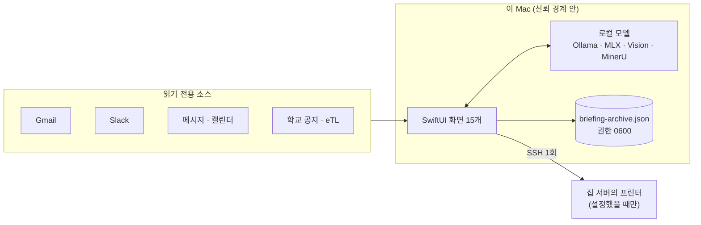

# 서울대 로컬 에이전트

**메일과 학교 공지를 오늘 할 일로 정리하고, 녹음을 받아쓰고, 문서를 읽고, 사진과 영상을 다듬는 맥 앱. 전부 이 Mac 안에서 돕니다.**

파일을 처음 보는 웹사이트에 올리지 않아도 되고, 계정을 만들지 않아도 되고, 구독하지 않아도 됩니다. 서울대 구성원이라면 누구나 내려받아 쓰라고 공개해 둔 것입니다.

<table>
<tr>
<td width="50%"></td>
<td width="50%"></td>
</tr>
<tr>
<td align="center"><sub><b>개요</b> — 지금 무엇이 준비되어 있고 무엇이 안 되는지를 첫 화면에서 말합니다</sub></td>
<td align="center"><sub><b>문서 인식</b> — 강의 슬라이드 사진과 스캔 PDF를 글자로</sub></td>
</tr>
<tr>
<td width="50%"></td>
<td width="50%"></td>
</tr>
<tr>
<td align="center"><sub><b>형식 변환</b> — 사진·오디오·영상·문서를 다른 형식으로, 기기 안에서</sub></td>
<td align="center"><sub><b>프린트</b> — 집에 둔 프린터로 보냅니다(설정하지 않으면 꺼져 있습니다)</sub></td>
</tr>
</table>

---

## 무엇을 할 수 있나

| 화면 | 하는 일 |
|---|---|
| **개요** | 지금 무엇이 준비되어 있는지, 무엇이 빠졌는지, 어떻게 채우는지를 한 화면에서 |
| **문서 인식** | 강의 슬라이드 사진, 스캔한 유인물 PDF, 화면의 일부를 텍스트로. `빠름`은 macOS Vision, `정밀`은 수식을 LaTeX로·표를 표로 살린 Markdown |
| **스캔 보정** | 비스듬히 찍은 유인물을 반듯하게 펴고 그늘을 지워 스캔한 것처럼. 여러 장을 한 PDF로 |
| **PDF 편집** | 합치기·나누기·쪽 정리·암호 걸고 풀기·서명 이미지와 워터마크 |
| **프린트** | 집에 둔 서버에 붙은 프린터로. 미리보기가 실제로 나갈 파일 그대로이고, 종이가 몇 장 나갈지 먼저 셉니다 |
| **녹음·전사** | 앱에서 바로 녹음하거나 파일을 드롭해 한국어 전사와 타임스탬프. 누가 말했는지도 가릅니다 |
| **전역 받아쓰기** | 어느 앱에서든 단축키로 녹음 → 기기 내 변환 → 커서 자리에 삽입 |
| **소리 다듬기** | 강의 녹음에서 에어컨 소리와 웅성거림을 걷어내고 음량을 고르게 |
| **누끼 따기** | 사진을 드롭하면 배경을 지운 투명 PNG |
| **화질 올리기** | 뒷자리에서 찍은 슬라이드, 저해상도 스캔을 크고 또렷하게 |
| **음악** | YouTube에서 곡을 찾아 플레이리스트를 만들되, 소리는 광고가 없는 곳에서만 냅니다 |
| **용량 줄이기 · 형식 변환** | 사진·PDF·영상·오디오·문서. 한글 문서(HWP·HWPX)도 읽습니다 |
| **자동 브리핑 · 보관함 · 일정 달력** | 메일·메시지·캘린더·학교 공지·eTL을 읽기 전용으로 모아 `오늘 꼭 할 일` / `확인해야 할 것` / `기타`로 정리하고, 날짜별로 앱 안에 쌓습니다 |

---

## 필요한 것

- **Apple Silicon 맥** (M1 이상). Intel 맥과 윈도우는 지원하지 않습니다.
- **macOS 26** 이상.
- **[Ollama](https://ollama.com)** — 브리핑 분류와 요약이 쓰는 로컬 모델을 돌립니다.
- **[uv](https://docs.astral.sh/uv/)** — 파이썬 도구들의 환경을 만듭니다. `brew install uv`
- **Xcode 명령줄 도구** — `xcode-select --install`

메모리는 많을수록 좋지만 **앱이 이 맥의 크기를 재서 알아서 맞춥니다.** 자세한 것은 아래 [모델은 기계를 따라간다](#모델은-기계를-따라간다)를 보세요.

---

## 설치

### 1. 내려받아 빌드하기

```sh
git clone https://github.com/sesepark/snu-local-agent.git
cd snu-local-agent
./scripts/build-app-bundle.sh
```

`dist/SeoulLocalAgent.app`이 만들어집니다. 원하는 곳으로 옮겨도 되지만 **저장소 폴더는 지우지 마세요** — 파이썬 도구들이 그 안에 삽니다.

### 2. 처음 열 때 (Gatekeeper)

이 앱은 Apple에 공증(notarization)을 받지 않았습니다. 유료 개발자 등록이 필요한 절차이고, 학생이 학생에게 나눠 주는 도구에 그것까지 두지는 않았습니다. 그래서 처음 열 때는 **우클릭 → 열기**를 쓰세요. 한 번만 하면 됩니다.

> 그래도 열리지 않으면: `xattr -dr com.apple.quarantine dist/SeoulLocalAgent.app`

### 3. 로컬 모델 받기

앱을 열고 **설정 › 연결 상태**를 보면 이 맥에 맞는 모델 이름과 받는 명령이 그대로 적혀 있습니다. 미리 받아 두려면 자기 맥에 해당하는 줄 하나만 실행하세요.

```sh
ollama pull qwen3.6:35b-a3b-nvfp4    # 메모리 48GB 이상
ollama pull qwen3:30b-a3b-q4_K_M     # 메모리 36GB 이상
ollama pull gpt-oss:20b              # 메모리 32GB 이상
```

### 4. 쓰고 싶은 도구만 골라 준비하기

각각 독립이라 **필요한 것만** 돌리면 됩니다. 하나도 안 돌려도 문서 인식(`빠름`)·스캔 보정·PDF 편집·음악·브리핑은 그대로 됩니다.

```sh
./scripts/setup-transcription-env.sh   # 녹음·전사, 전역 받아쓰기
./scripts/setup-matting-env.sh         # 누끼 따기
./scripts/setup-media-env.sh           # 소리 다듬기, 화질 올리기
./scripts/setup-docparse-env.sh        # 문서 인식 `정밀`
./scripts/setup-hwp.sh                 # 한글 문서를 서식째 변환
```

### 5. 무엇이 준비됐는지 확인하기

**설정 › 연결 상태**가 항목마다 되는지 안 되는지와, 안 되면 무엇을 하면 되는지를 말합니다. 창 없이 확인하려면:

```sh
dist/SeoulLocalAgent.app/Contents/MacOS/SeoulLocalAgent --connection-check
```

---

## 쓰는 법

### 자동 브리핑 — 흩어진 것을 한 화면으로

읽기 전용으로만 붙습니다. 이 앱은 메일을 보내거나, 읽음으로 바꾸거나, 지우지 않습니다.

- **Gmail** — [`gog`](https://github.com/steipete/gog)를 설치해 계정을 이은 다음, 볼 주소를 이 파일에 적습니다.

  `~/Library/Application Support/SeoulLocalAgent/gmail-accounts.json`
  ```json
  [{ "address": "you@snu.ac.kr", "mailboxIndex": 0 }]
  ```

  주소를 소스가 아니라 이 파일에 두는 이유는 그것이 개인 정보이기 때문입니다. 파일이 없으면 Gmail만 빠지고 나머지는 그대로 돕니다.
- **메시지 · 캘린더 · 미리 알림** — macOS가 권한을 물어봅니다. 거부해도 나머지는 그대로 돕니다.
- **학교 공지 · eTL** — 설정에서 볼 게시판을 고릅니다.
- **Slack** — 읽기 토큰이 있으면 넣고, 없으면 빠집니다.

정리된 결과는 **브리핑 보관함**에 날짜별로 쌓입니다(최근 90일). 잘못 분류된 항목은 한 칸씩 옮길 수 있고, 그 항목만 다시 분석할 수도 있고, Mac 캘린더나 미리 알림으로 넘길 수도 있습니다.

### 녹음·전사

앱에서 바로 녹음하거나 파일을 드롭합니다. 화자 구분까지 쓰려면 Hugging Face 토큰이 하나 필요한데, 설치 스크립트가 끝나면서 그 절차를 알려 줍니다. 토큰이 없어도 전사 자체는 됩니다.

### 프린트 — 안 쓰면 꺼져 있습니다

집에 서버(라즈베리파이면 충분합니다)를 두고 프린터를 USB로 붙여 둔 경우에만 쓰는 화면입니다. **설정 › 프린터**에 주소와 계정을 넣고 `등록 명령 복사`를 눌러 그 명령을 터미널에서 한 번 실행하면 이어집니다. 비워 두면 이 화면은 아무것도 하지 않고, 나머지 기능에는 영향이 없습니다.

### 단축키

`⌘1`…`⌘0`이 사이드바 순서대로이고, 그 뒤 화면들은 글자를 씁니다 — `⌘M` 음악, `⌘P` 프린트, `⌘B` 자동 브리핑, `⇧⌘B` 보관함.

---
---

# 어떻게 만들어졌나

여기부터는 이 앱이 왜 이런 모양인지에 대한 것입니다. 쓰는 데는 필요하지 않습니다.

## 이 앱이 서 있는 자리



바깥으로 나가는 길은 둘뿐입니다. 읽기 전용으로 읽어 오는 길과, 설정했을 때만 열리는 프린터로 가는 SSH 한 번. 수집한 내용은 이 맥의 파일 하나(`briefing-archive.json`, 권한 `0600`)에만 쌓입니다.

## 모델은 기계를 따라간다

브리핑 분류에 쓰는 모델 이름이 코드에 상수로 박혀 있었습니다. 만든 사람의 맥이 64GB였기 때문에 성립하던 값이고, 16GB인 맥에서 그 줄은 조용한 스왑을 뜻합니다.

그래서 등급을 임의로 나누는 대신 규칙 하나를 둡니다 — **가중치가 물리 메모리의 절반 안에 들어와야 한다.** 통합 메모리에서 절반을 넘기면 OS와 앱이 쓸 자리가 남지 않고, 그때 벌어지는 일은 실패가 아니라 **전부 조용히 느려지는 것**이라 알아채기 어렵습니다.

앱은 켜질 때 `hw.memsize`와 칩 이름을 읽고, 카탈로그에서 그 예산에 들어가는 가장 큰 모델을 고릅니다.

| 모델 | 가중치 크기 | 필요한 메모리 |
|---|---|---|
| `qwen3.6:35b-a3b-nvfp4` | 22.0 GB | 48 GB 이상 |
| `qwen3:30b-a3b-q4_K_M` | 17.3 GB | 36 GB 이상 |
| `gpt-oss:20b` | 12.8 GB | 32 GB 이상 |

셋 다 **4비트 MoE**입니다. 같은 메모리에서 mixture-of-experts는 토큰마다 파라미터의 일부만 켜므로, 같은 발자국의 밀집 모델보다 몇 배 빠르게 답합니다. 그래서 밀집 모델은 카탈로그에 넣지 않았습니다.

어느 것도 들어가지 않는 맥이면 준비 상태 화면이 Ollama에 묻기 **전에** 그렇게 말합니다 — 모델이 설치되어 있더라도 `준비됨`은 틀린 답이기 때문입니다. 설정에서 이름을 직접 적으면 그 선택이 이깁니다. 측정은 기본값이지 판결이 아닙니다.

## 왜 로컬인가

파일 하나를 변환하려고 웹에서 무료 도구를 찾아 헤매고, 처음 보는 사이트에 그 파일을 올리는 일이 반복됐습니다. 학생이 다루는 파일은 성적표, 장학금 서류, 아직 안 낸 과제, 녹음한 강의입니다. 그것을 올리지 않고 처리하려면 도구가 기기 안에 있어야 합니다.

그래서 이 앱의 기준은 둘입니다.

1. **데이터가 이 맥을 벗어나지 않는다.** 전사·문서 인식·배경 제거·화질 개선·형식 변환·브리핑 분류가 전부 기기 안에서 끝납니다.
2. **사용자가 켜지 않은 것은 스스로 시작하지 않는다.** 배경에서 도는 폴링을 두지 않고, 밤에 스스로 한 번 도는 것도 설정에서 켤 때만 합니다.

## 프로세스는 반드시 죽는다

파이썬 러너 몇 개는 파일 사이에 모델을 메모리에 물고 상주합니다. 그것이 남으면 사용자의 맥은 아무 이유 없이 몇 GB를 잃습니다. 그래서 한 겹에 기대지 않고 겹쳐 둡니다 — 명시적 종료, 프로세스 트리 정리, 그리고 다음 실행이 명령줄의 고정 표식으로 지난번의 유령을 찾아 죽이는 것.

## 확장 가능성 — 이 앱의 원래 모습

이 저장소는 개인용으로 만든 것에서 로봇 부분을 걷어낸 배포판입니다. 원래 앱에는 화면이 일곱 개 더 있습니다. 집 서버에 붙은 로봇 팔(SO-ARM101)을 SSH 터널 너머로 조작하고, 3D로 그린 팔을 끌면 진짜 팔이 따라오고, VLA 학습용 시연을 찍고, 그 데이터셋을 학습 서버로 보내 정책을 학습시키고, 학습된 정책을 팔에 태워 자리별 성공률을 재는 화면들입니다.

여기서 뺀 이유는 그것이 특정 하드웨어를 전제로 하기 때문입니다. 다만 얼개는 그대로 남아 있습니다 — **집에 둔 서버를 SSH 너머의 원격 제어면으로 삼고, 무거운 계산은 그쪽이 하고, 맥은 화면과 안전만 쥔다.** 그 구조가 프린트 화면에 그대로 살아 있고, 다른 장치를 같은 방식으로 붙이는 데 필요한 것은 서버 쪽 HTTP API 하나입니다.

## 만든 방법

서울대가 구성원에게 제공하는 **ChatGPT Edu** 계정으로 로그인한 Codex를 페어 프로그래머이자 이론 선생으로 삼아 만들었습니다. 몰랐던 것은 코드보다 원리를 먼저 물었고, 답을 받으면 곧바로 테스트로 옮겨 스스로 확인했습니다.

지금 이 저장소는 Swift 3.4만 줄, 화면 15개, 테스트 369개입니다.

```sh
./scripts/run-tests.sh
```

## 라이선스

MIT. 마음대로 쓰고 고치고 나눠 주세요.
